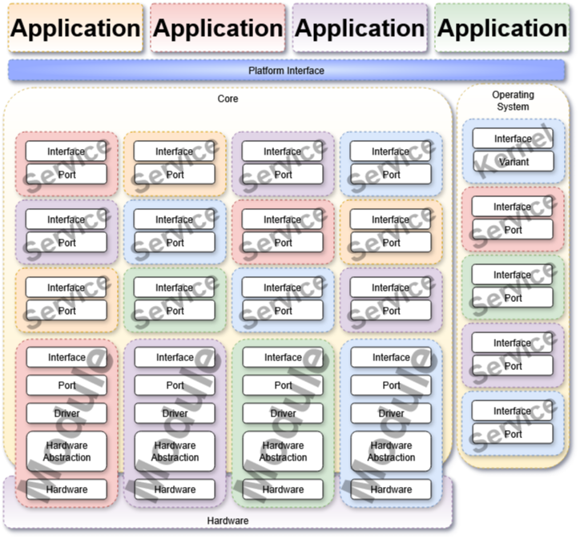

# Platform

Modularized abstraction for **generic computing device**. It encapsulates multiple layers internally such as **board support package ( BSP )**, **hardware abstraction layer ( HAL )**, **drivers**, **operating system**, ... etc.

---
# Terminologies

| Term      | Definition                                                                                                                                         |
| :-------- | :------------------------------------------------------------------------------------------------------------------------------------------------- |
| Interface | Outline of what functionalities are being provided and how they can be accessed, without exposing internal details.                                |
| Variant   | Alternatives targeting same or similar objectives.                                                                                                 |
| Port      | Adaptation layer for different computing devices and/or environments.                                                                              |
| Driver    | Bridge layer for a particular device type, provides and/or manages the operating and/or controlling functionalities being provided by that device. |
| Stub      | Template or predefined implementation for missing or _not-yet-implemented_ functionalities.                                                        |
| Hardware  | Physical components of a computing device.                                                                                                         |

---
# Architecture

As for its architecture, It has several components, Three are considered main components, **Kernel**, **Module**, and **Service** . Other components can be considered as assisted components for the main components.




---
# Components

## Main

### Kernel

The platform **core component**, it is a middle layer between the actual operating system variant and the platform itself. It controls application/module/service access to the operating system functionalities.

### Module

The platform **worker component**, it is an abstraction layer for hardware chipsets.

### Service

The platform **service component**, it makes use platform modules to achieve a higher level functionality.

## Others

### Library

The platform **library component**, it provides various toolsets for other components.

---
# Convention
## Naming

Follows **Ada Case (Camel Snake Case)** for the kernel/module/service/library roots and types, and follows **camel case** for attributes/methods.

> [!IMPORTANT]
> Digits are **always** prefixed by **underscore**.
> Capital letter names **always** follows **Ada Case**
### Example

```C
typedef enum GPIOx
{
  GPIO_All = ~0, ///< All
  GPIO_Null,     ///< Null
  ...,           ///< ...
  GPIO_Count,    ///< Count
} GPIO_t;

typedef enum GPIO_Mode
{
  GPIO_Mode_Input = 0,                  ///< Input (High Impedance)
  GPIO_Mode_Output,                     ///< Output (Push-Pull)
  GPIO_Mode_OutputOpenDrain,            ///< Output (Open-Drain)
  GPIO_Mode_Interrupt,                  ///< Interrupt (On Change)
  GPIO_Mode_InterruptRising,            ///< Interrupt (On Rising)
  GPIO_Mode_InterruptFalling,           ///< Interrupt (On Falling)
  GPIO_Mode_Event,                      ///< Event (On Change)
  GPIO_Mode_EventRising,                ///< Event (On Rising)
  GPIO_Mode_EventFalling,               ///< Event (On Falling)
  GPIO_Mode_AlternateFunction,          ///< Alternate Function (Push-Pull)
  GPIO_Mode_AlternateFunctionOpenDrain, ///< Alternate Function (Open-Drain)
} GPIO_Mode_t;

typedef enum GPIO_Function
{
  GPIO_Function_IO = 0,            ///< Default

  GPIO_Function_USART_1_CK,        ///<
  GPIO_Function_USART_1_TX,        ///<
  GPIO_Function_USART_1_RX,        ///<
  GPIO_Function_USART_1_CTS,       ///<
  GPIO_Function_USART_1_RTS,       ///<
  GPIO_Function_USART_1_DE,        ///<

  GPIO_Function_UART_4_TX,         ///<
  GPIO_Function_UART_4_RX,         ///<
  GPIO_Function_UART_4_CTS,        ///<
  GPIO_Function_UART_4_RTS,        ///<
  GPIO_Function_UART_4_DE,         ///<

  GPIO_Function_LPUART_1_TX,       ///<
  GPIO_Function_LPUART_1_RX,       ///<
  GPIO_Function_LPUART_1_CTS,      ///<
  GPIO_Function_LPUART_1_RTS,      ///<
  GPIO_Function_LPUART_1_DE,       ///<

  GPIO_Function_SPI_1_SCK,         ///<
  GPIO_Function_SPI_1_NSS,         ///<
  GPIO_Function_SPI_1_MOSI,        ///<
  GPIO_Function_SPI_1_MISO,        ///<

  GPIO_Function_QUADSPI_CLK,       ///<
  GPIO_Function_QUADSPI_BK_1_NCS,  ///<
  GPIO_Function_QUADSPI_BK_1_IO_0, ///<
  GPIO_Function_QUADSPI_BK_1_IO_1, ///<
  GPIO_Function_QUADSPI_BK_1_IO_2, ///<
  GPIO_Function_QUADSPI_BK_1_IO_3, ///<
  GPIO_Function_QUADSPI_BK_2_NCS,  ///<
  GPIO_Function_QUADSPI_BK_2_IO_0, ///<
  GPIO_Function_QUADSPI_BK_2_IO_1, ///<
  GPIO_Function_QUADSPI_BK_2_IO_2, ///<
  GPIO_Function_QUADSPI_BK_2_IO_3, ///<

  GPIO_Function_I2C_1_SCL,         ///<
  GPIO_Function_I2C_1_SDA,         ///<
  GPIO_Function_I2C_1_SMBA,        ///<

  ...,                             ///<
} GPIO_Function_t;

GPIO_Status_t GPIO_SetMode( GPIO_t GPIOx, GPIO_Mode_t Mode );

GPIO_Status_t GPIO_SetFunction( GPIO_t GPIOx, GPIO_Function_t Function );
```

# Directory structure

```markdown
Platform/
├─ Docs/              # Documents
├─ Kernel/            # Kernel
│  ├─ port/           # HW board/platform implementations
│  │  ├─ ...          # specific hw board/platform
│  │  └─ Stub         # stub
│  ├─ variant/        # OS variant which provides interfaces, configurations, ...etc
│  │  ├─ BareMetal    # Bare-metal
│  │  ├─ FreeRTOS     # FreeRTOS
│  │  ├─ Zephyr       # Zephyr
│  │  └─ ...          # More
│  ├─ ...             # Source files
│  ├─ Kernel.h        # Interface
│  └─ README.md       # Overview
├─ Library/           # Libraries
│  ├─ BUFFER/         # Buffer
│  │  ├─ ...          # Source files
│  │  ├─ BUFFER.h     # Interface
│  │  └─ README.md    # Overview
│  ├─ LIST/           # List
│  │  ├─ ...          # Source files
│  │  ├─ LIST.h       # Interface
│  │  └─ README.md    # Overview
│  └─ ...             # Other libraries directories
├─ Module/            # Modules
│  ├─ GPIO/           # GPIO
│  │  ├─ driver/      # HW peripheral/module drivers
│  │  │  └─ ...       # specific hw peripheral/module implementation
│  │  ├─ port/        # HW board/platform implementations
│  │  │  ├─ ...       # specific hw board/platform
│  │  │  └─ Stub      # stub
│  │  ├─ ...          # Source files
│  │  ├─ GPIO.h       # Interface
│  │  └─ README.md    # Overview
│  ├─ RTC/            # RTC
│  │  ├─ driver/      # HW peripheral/module drivers
│  │  │  └─ ...       # specific hw peripheral/module implementation
│  │  ├─ port/        # HW board/platform implementations
│  │  │  ├─ ...       # specific hw board/platform
│  │  │  └─ Stub      # stub
│  │  ├─ ...          # Source files
│  │  ├─ RTC.h        # Interface
│  │  └─ README.md    # Overview
│  ├─ UART/           # UART
│  │  ├─ driver/      # HW peripheral/module drivers
│  │  │  └─ ...       # specific hw peripheral/module implementation
│  │  ├─ port/        # HW board/platform implementations
│  │  │  ├─ ...       # specific hw board/platform
│  │  │  └─ Stub      # stub
│  │  ├─ ...          # Source files
│  │  ├─ UART.h       # Interface
│  │  └─ README.md    # Overview
│  └─ ...             # Other modules directories
├─ port/              # Platform port configuration
│  └─ ...             # HW board/platform configuration such as pin-mapping, activated modules, services, ports, ...etc
├─ Service/           # Services
│  ├─ LOG/            # Logger
│  │  ├─ port/        # HW board/platform implementations
│  │  │  ├─ ...       # specific hw board/platform
│  │  │  └─ Stub      # stub
│  │  ├─ ...          # Source files
│  │  ├─ LOG.h        # Interface
│  │  └─ README.md    # Overview
│  ├─ TIM/            # Time
│  │  ├─ port/        # HW board/platform implementations
│  │  │  ├─ ...       # specific hw board/platform
│  │  │  └─ Stub      # stub
│  │  ├─ ...          # Source files
│  │  ├─ TIM.h        # Interface
│  │  └─ README.md    # Overview
│  └─ ...             # Other services directories
├─ Platform.h         # Interface
└─ README.md          # Overview
```
