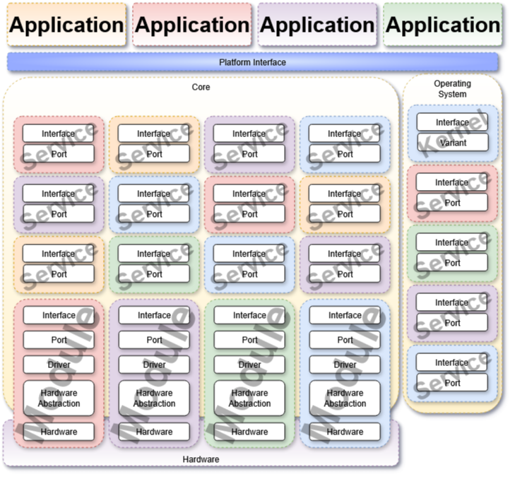

# Platform

Device agnostic modularized abstraction for **generic computing device**. It encapsulates multiple layers internally such as **board support package ( BSP )**, **hardware abstraction layer ( HAL )**, **drivers**, **operating system**, ... etc.

> [!NOTE]
> Platform is **not** an application in its own, it only serves as a device foundation layer that exposes all device capabilities. Upon which you can build various applications that make use of provided capabilities without the need to get into the hardware details, which let your focus only on the application side.

> [!NOTE]
> All components within the platform is not part of any application, each component within the platform serves as a building block of the platform.

---
# Terminologies

| Term      | Definition                                                                                                                                                                      |
| :-------- | :------------------------------------------------------------------------------------------------------------------------------------------------------------------------------ |
| Interface | Outline of what functionalities are being provided and how they can be accessed, without exposing internal details.                                                             |
| Variant   | Alternatives targeting same or similar objectives/functions.                                                                                                                    |
| Port      | Adaptation layer for different computing devices and/or environments.                                                                                                           |
| Driver    | Bridge layer for a particular device type, provides and/or manages the operating and/or controlling functionalities being provided by that specific hardware peripheral/module. |
| Stub      | Template or predefined implementation for missing or _not-yet-implemented_ functionalities.                                                                                     |
| Hardware  | Physical components of a computing device such as peripherals/modules/...etc.                                                                                                   |

---
# Architecture

As for platform architecture, It has several components, Three are considered main components, **Kernel**, **Module**, and **Service** . Other components can be considered as assisted components for the main components.




---
# Components

## Main

### Kernel

The platform **core component**, it is a middle layer between the actual operating system variant and the platform itself. It controls application/module/service access to the operating system like functionalities. Though kernel could be pure bare-metal or based on one of RTOS providers.

### Module

The platform **worker component**, it is an abstraction layer for hardware chipsets, it encapsulates internally a set of drivers that are being utilized based on the implementation port and the availability of underlying chipsets.

Examples for such modules are:
- GPIO module which abstracts the whole platform GPIOs functionalities, encapsulating internally whether the GPIO is internally (native) or externally accessible through expander for example.
- RTC module which abstracts platform RTC functionalities, encapsulating internally whether the RTC is internally (native) or externally accessible through some communication protocol.
- So on for UART, SPI, USB, ADC, GSM, ...etc.

### Service

The platform **service component**, it might make use of platform modules to achieve a higher level functionality but not restricted to the usage of the modules, some services might not depend on any modules at all.

Examples for such services are:
- LOGger service which might be directed to UART, USB, ... or other modules.
- TIMe service which might be directed to RTC, Timer, Tick, ... or other modules.
- So on for NETwork, MEMory, UTIL, ...etc.

## Others

### Library

The platform **library component**, it provides various toolsets for other components, it is a generic, doesn't depend on any specific platform component. Though library is a standalone component.

---
# Convention
## Naming

Prefixes follows **Ada Case (Camel Snake Case)** for the kernel/module/service/library roots and types, and follows **camel case** for attributes/methods suffixes.

> [!IMPORTANT]
> Digits are **always** prefixed by **underscore**.
> Upper case names **always** follows **Ada Case**
### Example

```C
typedef enum GPIOx
{
  GPIO_All = ~0, ///< All
  GPIO_Null,     ///< Null
  ...,           ///< ...
  GPIO_Count,    ///< Count
} GPIO_t;

typedef enum GPIO_Mode
{
  GPIO_Mode_Input = 0,                  ///< Input (High Impedance)
  GPIO_Mode_Output,                     ///< Output (Push-Pull)
  GPIO_Mode_OutputOpenDrain,            ///< Output (Open-Drain)
  GPIO_Mode_Interrupt,                  ///< Interrupt (On Change)
  GPIO_Mode_InterruptRising,            ///< Interrupt (On Rising)
  GPIO_Mode_InterruptFalling,           ///< Interrupt (On Falling)
  GPIO_Mode_Event,                      ///< Event (On Change)
  GPIO_Mode_EventRising,                ///< Event (On Rising)
  GPIO_Mode_EventFalling,               ///< Event (On Falling)
  GPIO_Mode_AlternateFunction,          ///< Alternate Function (Push-Pull)
  GPIO_Mode_AlternateFunctionOpenDrain, ///< Alternate Function (Open-Drain)
} GPIO_Mode_t;

typedef enum GPIO_Function
{
  GPIO_Function_IO = 0,            ///< Default

  GPIO_Function_USART_1_CK,        ///<
  GPIO_Function_USART_1_TX,        ///<
  GPIO_Function_USART_1_RX,        ///<
  GPIO_Function_USART_1_CTS,       ///<
  GPIO_Function_USART_1_RTS,       ///<
  GPIO_Function_USART_1_DE,        ///<

  GPIO_Function_UART_4_TX,         ///<
  GPIO_Function_UART_4_RX,         ///<
  GPIO_Function_UART_4_CTS,        ///<
  GPIO_Function_UART_4_RTS,        ///<
  GPIO_Function_UART_4_DE,         ///<

  GPIO_Function_LPUART_1_TX,       ///<
  GPIO_Function_LPUART_1_RX,       ///<
  GPIO_Function_LPUART_1_CTS,      ///<
  GPIO_Function_LPUART_1_RTS,      ///<
  GPIO_Function_LPUART_1_DE,       ///<

  GPIO_Function_SPI_1_SCK,         ///<
  GPIO_Function_SPI_1_NSS,         ///<
  GPIO_Function_SPI_1_MOSI,        ///<
  GPIO_Function_SPI_1_MISO,        ///<

  GPIO_Function_QUADSPI_CLK,       ///<
  GPIO_Function_QUADSPI_BK_1_NCS,  ///<
  GPIO_Function_QUADSPI_BK_1_IO_0, ///<
  GPIO_Function_QUADSPI_BK_1_IO_1, ///<
  GPIO_Function_QUADSPI_BK_1_IO_2, ///<
  GPIO_Function_QUADSPI_BK_1_IO_3, ///<
  GPIO_Function_QUADSPI_BK_2_NCS,  ///<
  GPIO_Function_QUADSPI_BK_2_IO_0, ///<
  GPIO_Function_QUADSPI_BK_2_IO_1, ///<
  GPIO_Function_QUADSPI_BK_2_IO_2, ///<
  GPIO_Function_QUADSPI_BK_2_IO_3, ///<

  GPIO_Function_I2C_1_SCL,         ///<
  GPIO_Function_I2C_1_SDA,         ///<
  GPIO_Function_I2C_1_SMBA,        ///<

  ...,                             ///<
} GPIO_Function_t;

GPIO_Status_t GPIO_SetMode( GPIO_t GPIOx, GPIO_Mode_t Mode );

GPIO_Status_t GPIO_SetFunction( GPIO_t GPIOx, GPIO_Function_t Function );
```

# Directory structure

```markdown
Platform/
├─ Docs/              # Documents
├─ Kernel/            # Kernel
│  ├─ port/           # HW board/platform implementations
│  │  ├─ ...          # specific hw board/platform
│  │  └─ Stub         # stub
│  ├─ variant/        # OS variant which provides interfaces, configurations, ...etc
│  │  ├─ BareMetal    # Bare-metal
│  │  ├─ FreeRTOS     # FreeRTOS
│  │  ├─ Zephyr       # Zephyr
│  │  └─ ...          # More
│  ├─ ...             # Source files
│  ├─ Kernel.h        # Interface
│  └─ README.md       # Overview
├─ Library/           # Libraries
│  ├─ BUFFER/         # Buffer
│  │  ├─ ...          # Source files
│  │  ├─ BUFFER.h     # Interface
│  │  └─ README.md    # Overview
│  ├─ LIST/           # List
│  │  ├─ ...          # Source files
│  │  ├─ LIST.h       # Interface
│  │  └─ README.md    # Overview
│  └─ ...             # Other libraries directories
├─ Module/            # Modules
│  ├─ GPIO/           # GPIO
│  │  ├─ driver/      # HW peripheral/module drivers
│  │  │  └─ ...       # specific hw peripheral/module implementation
│  │  ├─ port/        # HW board/platform implementations
│  │  │  ├─ ...       # specific hw board/platform
│  │  │  └─ Stub      # stub
│  │  ├─ ...          # Source files
│  │  ├─ GPIO.h       # Interface
│  │  └─ README.md    # Overview
│  ├─ RTC/            # RTC
│  │  ├─ driver/      # HW peripheral/module drivers
│  │  │  └─ ...       # specific hw peripheral/module implementation
│  │  ├─ port/        # HW board/platform implementations
│  │  │  ├─ ...       # specific hw board/platform
│  │  │  └─ Stub      # stub
│  │  ├─ ...          # Source files
│  │  ├─ RTC.h        # Interface
│  │  └─ README.md    # Overview
│  ├─ UART/           # UART
│  │  ├─ driver/      # HW peripheral/module drivers
│  │  │  └─ ...       # specific hw peripheral/module implementation
│  │  ├─ port/        # HW board/platform implementations
│  │  │  ├─ ...       # specific hw board/platform
│  │  │  └─ Stub      # stub
│  │  ├─ ...          # Source files
│  │  ├─ UART.h       # Interface
│  │  └─ README.md    # Overview
│  └─ ...             # Other modules directories
├─ port/              # Platform port configuration
│  └─ ...             # HW board/platform configuration such as pin-mapping, activated modules, services, ports, ...etc
├─ Service/           # Services
│  ├─ LOG/            # Logger
│  │  ├─ port/        # HW board/platform implementations
│  │  │  ├─ ...       # specific hw board/platform
│  │  │  └─ Stub      # stub
│  │  ├─ ...          # Source files
│  │  ├─ LOG.h        # Interface
│  │  └─ README.md    # Overview
│  ├─ TIM/            # Time
│  │  ├─ port/        # HW board/platform implementations
│  │  │  ├─ ...       # specific hw board/platform
│  │  │  └─ Stub      # stub
│  │  ├─ ...          # Source files
│  │  ├─ TIM.h        # Interface
│  │  └─ README.md    # Overview
│  └─ ...             # Other services directories
├─ Platform.h         # Interface
└─ README.md          # Overview
```


# TODO

- [ ] Add RCC Module
- [ ] 